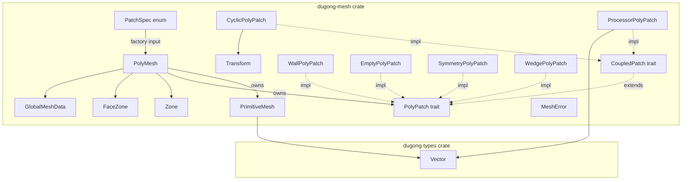

# 設計ドキュメント — mesh-poly（PolyMesh レイヤー）

## 概要

**目的**: `dugong-mesh` クレートに PolyMesh レイヤーを追加し、有限体積法に必要な境界パッチ・ゾーン・並列メタデータを `PrimitiveMesh` の上に統合する。

**ユーザー**: CFD フレームワーク開発者が、メッシュのパッチ分類・ゾーン選択・並列トポロジ情報に統一的にアクセスするために使用する。

**影響**: 既存の `PrimitiveMesh` を内包する上位構造体 `PolyMesh` を導入し、`MeshError` にパッチ関連バリアントを追加する。既存 API に破壊的変更はない。

### ゴール
- `PolyPatch` trait 階層による境界パッチの統一的な抽象化
- `PatchSpec` enum による軽量なパッチ仕様定義と、PolyMesh 構築時のファクトリ変換
- 6 種の具象パッチ型（Wall, Cyclic, Processor, Empty, Symmetry, Wedge）の提供
- ゾーン型（`Zone`, `FaceZone`）によるメッシュ部分領域の管理
- `GlobalMeshData` による並列トポロジ情報の保持
- `PolyMesh` による全情報の一元管理と安全な構築

### 非ゴール
- メッシュファイルの I/O（別スペックで対応）
- `FvMesh`（Spec 2-3）の実装
- MPI 通信の実装（パッチは通信に必要な情報を保持するが、通信自体は行わない）
- 動的メッシュの変形ロジック（`move_points()` フックのみ提供）。動的メッシュでの `neighbor_cell_centers` 再交換機構（`CoupledPatch` への更新メソッド追加、またはパッチ再構築）は Spec 2-3 で設計する。本スペックの `move_points()` フックと `CoupledPatch::face_cells()` が拡張ポイントとして機能する
- `GlobalMeshData` の共有点情報（`shared_point_labels` / `shared_point_addressing`）。必要に応じて後続スペックで拡張する

## アーキテクチャ

### 既存アーキテクチャ分析

- `PrimitiveMesh` がメッシュのコアデータ（点・面・owner/neighbor）と遅延計算される幾何量・接続情報を提供
- `MeshError` が `thiserror` ベースの 3 バリアントを持つ
- `geometry` モジュールは `pub(crate)` で内部利用のみ
- OpenFOAM 規約に準拠: 内部面が `faces[0..n_internal_faces]`、境界面が `faces[n_internal_faces..n_faces]`

### アーキテクチャパターン & 境界マップ



**アーキテクチャ統合**:
- **選択パターン**: Specification / Factory 分離 — パッチの「定義（`PatchSpec` enum）」と「初期化済みオブジェクト（`Box<dyn PolyPatch>`）」を型レベルで分離。`PolyMesh::new` 内で `PatchSpec` から具象パッチを構築し、結合パッチには隣接セル中心を注入する。これにより半初期化状態のパッチが存在不可能になる（`research.md` 参照）
- **コンポジション**: `PolyMesh` が `PrimitiveMesh` を所有し、全アクセサを委譲メソッドで公開
- **ドメイン境界**: 構築後のパッチは trait オブジェクト（`Box<dyn PolyPatch>`）で多態性を実現。構築前のパッチ仕様は `PatchSpec` enum で閉じた型として表現
- **既存パターン維持**: `OnceLock` による遅延計算パターン、`thiserror` によるエラー型、OpenFOAM の面インデックス規約
- **新コンポーネントの根拠**: `PatchSpec` は構築フロー（メッシュ読み込み → MPI 通信 → パッチ構築）と型安全性（不正な中間状態の排除）を両立させるために導入
- **Steering 準拠**: コンポジション優先、`unsafe` 不使用、`Send + Sync` 保証、米国式英語

### 技術スタック

| レイヤー | 選択 / バージョン | 機能における役割 | 備考 |
|---------|-----------------|----------------|------|
| 言語 | Rust Edition 2024 | 全実装 | ワークスペース設定に準拠 |
| 型基盤 | `dugong-types` | `Vector` 型の提供 | 既存依存 |
| エラー | `thiserror` | `MeshError` の derive | 既存依存 |

新規外部依存なし。

## 要件トレーサビリティ

| 要件 | 概要 | コンポーネント | インターフェース | フロー |
|------|------|--------------|----------------|-------|
| 1.1–1.9 | PolyPatch trait 階層 | PolyPatch trait, CoupledPatch trait | Service | — |
| 2.1–2.9 | パッチ具象型 | WallPolyPatch 他 6 型 | Service | — |
| 3.1–3.3 | Cyclic 変換情報 | CyclicPolyPatch, Transform | Service | — |
| 4.1–4.2 | Processor 並列情報 | ProcessorPolyPatch | Service | — |
| 5.1–5.5 | ゾーン型 | Zone, FaceZone | Service | — |
| 6.1–6.2 | GlobalMeshData | GlobalMeshData | Service | — |
| 7.1–7.7 | PolyMesh 構造体 | PolyMesh | Service | — |
| 8.1–8.8 | PolyMesh 構築 | PatchSpec, PolyMesh::new | Service | 構築バリデーション |
| 9.1–9.3 | エラーハンドリング | MeshError | — | — |

## コンポーネント & インターフェース

### サマリーテーブル

| コンポーネント | ドメイン | 目的 | 要件 | 主要依存 | コントラクト |
|--------------|---------|------|------|---------|------------|
| PolyPatch trait | パッチ抽象化 | 境界パッチの共通インターフェース | 1.1–1.9 | — | Service |
| CoupledPatch trait | パッチ抽象化 | 結合パッチのサブインターフェース | 1.6–1.9 | PolyPatch (P0) | Service |
| WallPolyPatch | パッチ具象型 | 壁境界 | 2.1, 2.9 | PolyPatch (P0) | Service |
| CyclicPolyPatch | パッチ具象型 | 周期境界 | 2.2, 2.7, 3.1–3.3 | CoupledPatch (P0), Transform (P0) | Service |
| ProcessorPolyPatch | パッチ具象型 | プロセッサ境界 | 2.3, 2.8, 4.1–4.2 | CoupledPatch (P0) | Service |
| EmptyPolyPatch | パッチ具象型 | 空境界（2D 計算用） | 2.4, 2.9 | PolyPatch (P0) | Service |
| SymmetryPolyPatch | パッチ具象型 | 対称面境界 | 2.5, 2.9 | PolyPatch (P0) | Service |
| WedgePolyPatch | パッチ具象型 | くさび境界（軸対称用） | 2.6, 2.9 | PolyPatch (P0) | Service |
| PatchSpec | データ型 | パッチ仕様の値型定義 | 8.1 | Transform (P0) | — |
| Transform | データ型 | 周期変換情報 | 3.1 | Vector (P0) | — |
| Zone | データ型 | セル/ポイントゾーン | 5.1, 5.3, 5.4 | — | Service |
| FaceZone | データ型 | フェイスゾーン | 5.2–5.5 | — | Service |
| GlobalMeshData | データ型 | 並列トポロジ情報 | 6.1–6.2 | — | Service |
| PolyMesh | 統合構造体 | メッシュ全情報の一元管理 | 7.1–7.7, 8.1–8.8 | PrimitiveMesh (P0), PatchSpec (P0) | Service |
| MeshError | エラー型 | パッチ関連エラーバリアント | 9.1–9.3 | — | — |

---

### パッチ抽象化レイヤー

#### PolyPatch trait

| フィールド | 詳細 |
|----------|------|
| 目的 | 境界パッチの共通インターフェースを定義する |
| 要件 | 1.1, 1.2, 1.3, 1.4, 1.5, 1.8 |

**責務 & 制約**
- パッチの識別情報（名前・種別）と面範囲（開始インデックス・サイズ）へのアクセスを提供
- `Send + Sync` を要求し、スレッド安全性を保証
- オブジェクト安全であり、`Box<dyn PolyPatch>` として使用可能
- `as_coupled()` / `as_coupled_mut()` によるダウンキャストをデフォルト実装で提供
- `move_points()` フックをデフォルト実装（no-op）で提供

**依存**
- Outbound: `CoupledPatch` trait — ダウンキャスト先 (P1)
- External: `dugong_types::Vector` — 点座標 (P0)

**コントラクト**: Service [x]

##### サービスインターフェース

```rust
/// Patch kind identifier for runtime dispatch.
#[derive(Debug, Clone, PartialEq, Eq)]
pub enum PatchKind {
    Wall,
    Cyclic,
    Processor,
    Empty,
    Symmetry,
    Wedge,
}

/// Common interface for all boundary patches.
///
/// Object-safe: can be used as `Box<dyn PolyPatch>`.
/// Requires `Send + Sync` for thread safety.
pub trait PolyPatch: Send + Sync {
    /// Returns the patch name.
    fn name(&self) -> &str;

    /// Returns the start face index in the global face list.
    fn start(&self) -> usize;

    /// Returns the number of faces in this patch.
    fn size(&self) -> usize;

    /// Returns the patch kind.
    fn kind(&self) -> PatchKind;

    /// Attempts to downcast to a coupled patch (immutable).
    /// Default returns `None` for non-coupled patches.
    fn as_coupled(&self) -> Option<&dyn CoupledPatch> {
        None
    }

    /// Attempts to downcast to a coupled patch (mutable).
    /// Default returns `None` for non-coupled patches.
    fn as_coupled_mut(&mut self) -> Option<&mut dyn CoupledPatch> {
        None
    }

    /// Hook called when mesh points are moved.
    /// Default is a no-op. Patch types can override for
    /// type-specific updates.
    fn move_points(&mut self, _points: &[Vector]) {}
}
```

- 事前条件: なし
- 事後条件: `name()` は空でない文字列を返す。`start() + size()` は面の総数以下
- 不変条件: パッチの面範囲は構築後に変更されない

---

#### CoupledPatch trait

| フィールド | 詳細 |
|----------|------|
| 目的 | 結合パッチ（隣接セル情報を持つパッチ）のサブインターフェースを定義する |
| 要件 | 1.6, 1.7, 1.9 |

**責務 & 制約**
- face-cell マッピング・隣接セル中心・隣接ランク番号・変換情報へのアクセスを提供
- `PolyPatch` のスーパー trait として定義
- オブジェクト安全であり、`&dyn CoupledPatch` / `&mut dyn CoupledPatch` として使用可能

**依存**
- Inbound: `PolyPatch` trait — スーパー trait (P0)
- External: `dugong_types::Vector` — セル中心座標 (P0)

**コントラクト**: Service [x]

##### サービスインターフェース

```rust
/// Sub-trait for coupled patches (patches with neighbor cell info).
///
/// Object-safe: can be used as `&dyn CoupledPatch`.
pub trait CoupledPatch: PolyPatch {
    /// Returns the face-to-cell mapping for this patch.
    /// Maps each patch face to its owner cell index.
    fn face_cells(&self) -> &[usize];

    /// Returns the neighbor cell centers.
    fn neighbor_cell_centers(&self) -> &[Vector];

    /// Returns the neighbor rank number.
    /// `Some(rank)` for processor patches, `None` for cyclic patches.
    fn neighbor_rank(&self) -> Option<i32>;

    /// Returns the geometric transform (for cyclic patches).
    /// `None` for processor patches.
    fn transform(&self) -> Option<&Transform>;
}
```

- 事前条件: なし
- 事後条件: `face_cells().len() == size()`、`neighbor_cell_centers().len() == size()`（パッチの面数と一致）
- 不変条件: `neighbor_rank()` は `ProcessorPolyPatch` で `Some`、`CyclicPolyPatch` で `None` を返す

---

### パッチ具象型レイヤー

#### WallPolyPatch

| フィールド | 詳細 |
|----------|------|
| 目的 | 壁境界パッチの具象実装 |
| 要件 | 2.1, 2.9 |

**責務 & 制約**
- `PolyPatch` を実装。`as_coupled()` は `None` を返す（デフォルト実装）
- 名前・開始面インデックス・サイズを保持

**コントラクト**: Service [x]

##### サービスインターフェース

```rust
pub struct WallPolyPatch {
    name: String,
    start: usize,
    size: usize,
}

impl WallPolyPatch {
    pub fn new(name: String, start: usize, size: usize) -> Self;
}
```

**実装メモ**
- `EmptyPolyPatch`, `SymmetryPolyPatch`, `WedgePolyPatch` は同一構造。実装パターンは同じで、`kind()` の戻り値のみ異なる

---

#### CyclicPolyPatch

| フィールド | 詳細 |
|----------|------|
| 目的 | 周期境界パッチの具象実装 |
| 要件 | 2.2, 2.7, 3.1, 3.2, 3.3, 3.4 |

**責務 & 制約**
- `PolyPatch` と `CoupledPatch` の両方を実装
- `as_coupled()` は `Some(&dyn CoupledPatch)` を返す
- `Transform` による幾何的変換情報を保持
- 隣接セル中心は構築時にコンストラクタ引数として受け取る（構築後は不変）
- `neighbor_rank()` は `None` を返す

**依存**
- Outbound: `Transform` — 変換情報 (P0)
- External: `dugong_types::Vector` — セル中心座標 (P0)

**コントラクト**: Service [x]

##### サービスインターフェース

```rust
pub struct CyclicPolyPatch {
    name: String,
    start: usize,
    size: usize,
    transform: Transform,
    face_cells: Vec<usize>,
    neighbor_cell_centers: Vec<Vector>,
}

impl CyclicPolyPatch {
    pub fn new(
        name: String,
        start: usize,
        size: usize,
        transform: Transform,
        face_cells: Vec<usize>,
        neighbor_cell_centers: Vec<Vector>,
    ) -> Self;
}
```

**実装メモ**
- `CyclicPolyPatch` はユーザーが直接構築しない。`PolyMesh::new` 内で `PatchSpec::Cyclic` と隣接セル中心マップから構築される

---

#### ProcessorPolyPatch

| フィールド | 詳細 |
|----------|------|
| 目的 | プロセッサ境界パッチの具象実装 |
| 要件 | 2.3, 2.8, 4.1, 4.2 |

**責務 & 制約**
- `PolyPatch` と `CoupledPatch` の両方を実装
- `as_coupled()` は `Some(&dyn CoupledPatch)` を返す
- 隣接ランク番号（`i32`）を保持
- 隣接セル中心は構築時にコンストラクタ引数として受け取る（構築後は不変）
- face-cell マッピングへのアクセスを提供
- `neighbor_rank()` は `Some(rank)` を返す
- `transform()` は `None` を返す

**依存**
- External: `dugong_types::Vector` — セル中心座標 (P0)

**コントラクト**: Service [x]

##### サービスインターフェース

```rust
pub struct ProcessorPolyPatch {
    name: String,
    start: usize,
    size: usize,
    neighbor_rank: i32,
    neighbor_cell_centers: Vec<Vector>,
    face_cells: Vec<usize>,
}

impl ProcessorPolyPatch {
    pub fn new(
        name: String,
        start: usize,
        size: usize,
        neighbor_rank: i32,
        face_cells: Vec<usize>,
        neighbor_cell_centers: Vec<Vector>,
    ) -> Self;
}
// face_cells() is provided via CoupledPatch trait implementation.
```

**実装メモ**
- `ProcessorPolyPatch` はユーザーが直接構築しない。`PolyMesh::new` 内で `PatchSpec::Processor` と隣接セル中心マップから構築される

---

#### EmptyPolyPatch / SymmetryPolyPatch / WedgePolyPatch

| フィールド | 詳細 |
|----------|------|
| 目的 | 非結合パッチ型（空境界・対称面・くさび） |
| 要件 | 2.4, 2.5, 2.6, 2.9 |

**実装メモ**
- `WallPolyPatch` と同一構造（`name`, `start`, `size`）
- `PolyPatch` を実装。`as_coupled()` は `None` を返す（デフォルト実装）
- `kind()` でそれぞれ `PatchKind::Empty` / `PatchKind::Symmetry` / `PatchKind::Wedge` を返す
- 各型に `new(name: String, start: usize, size: usize) -> Self` コンストラクタを提供

---

### データ型レイヤー

#### PatchSpec

| フィールド | 詳細 |
|----------|------|
| 目的 | パッチの仕様を軽量な値型として定義する。構築フロー（メッシュ読み込み → 隣接データ収集 → パッチ構築）において、具象パッチオブジェクトの生成前にパッチの構成情報を保持する |
| 要件 | 8.1 |

**責務 & 制約**
- 各パッチ種別に必要な構築パラメータを enum バリアントとして保持
- 純粋なデータ型（trait オブジェクトではない）
- `PolyMesh::new` 内で `Box<dyn PolyPatch>` に変換される

**コントラクト**: なし（値型）

```rust
/// Lightweight patch specification for PolyMesh construction.
///
/// Describes what patches exist and their parameters, without
/// creating actual patch objects. Converted to concrete patch types
/// inside `PolyMesh::new`.
#[derive(Debug, Clone)]
pub enum PatchSpec {
    Wall {
        name: String,
        start: usize,
        size: usize,
    },
    Cyclic {
        name: String,
        start: usize,
        size: usize,
        transform: Transform,
        face_cells: Vec<usize>,
    },
    Processor {
        name: String,
        start: usize,
        size: usize,
        neighbor_rank: i32,
        face_cells: Vec<usize>,
    },
    Empty {
        name: String,
        start: usize,
        size: usize,
    },
    Symmetry {
        name: String,
        start: usize,
        size: usize,
    },
    Wedge {
        name: String,
        start: usize,
        size: usize,
    },
}

impl PatchSpec {
    /// Returns the patch name.
    pub fn name(&self) -> &str;

    /// Returns the start face index.
    pub fn start(&self) -> usize;

    /// Returns the number of faces.
    pub fn size(&self) -> usize;

    /// Returns true if this is a coupled patch (Cyclic or Processor).
    pub fn is_coupled(&self) -> bool;
}
```

**実装メモ**
- `name()`, `start()`, `size()` は全バリアントに共通するフィールドへのアクセサ。match で分岐して各バリアントの同名フィールドを返す
- `is_coupled()` は `PatchSpec::Cyclic` と `PatchSpec::Processor` に対して `true` を返す
- enum の拡張性について: CFD のパッチ種別は安定しており、将来必要になれば `PatchSpec::Custom(Box<dyn CustomPatchSpec>)` バリアントで拡張可能

---

#### Transform

| フィールド | 詳細 |
|----------|------|
| 目的 | 周期パッチの幾何的変換（並進・回転）を表現する |
| 要件 | 3.1 |

**コントラクト**: なし（値型）

```rust
/// Geometric transform for cyclic patches.
#[derive(Debug, Clone, PartialEq)]
pub enum Transform {
    /// Translational periodicity with a separation vector.
    Translational { separation: Vector },
    /// Rotational periodicity around an axis.
    Rotational {
        axis: Vector,
        angle: f64,
        center: Vector,
    },
}
```

---

#### Zone

| フィールド | 詳細 |
|----------|------|
| 目的 | セル/ポイントのグループを名前付きで管理する |
| 要件 | 5.1, 5.3, 5.4 |

**コントラクト**: Service [x]

##### サービスインターフェース

```rust
/// Named group of cell or point indices.
pub struct Zone {
    name: String,
    indices: Vec<usize>,
}

impl Zone {
    pub fn new(name: String, indices: Vec<usize>) -> Self;

    /// Returns the zone name.
    pub fn name(&self) -> &str;

    /// Returns the index list.
    pub fn indices(&self) -> &[usize];
}
```

---

#### FaceZone

| フィールド | 詳細 |
|----------|------|
| 目的 | フェイスのグループを名前・flip map 付きで管理する |
| 要件 | 5.2, 5.3, 5.4, 5.5 |

**コントラクト**: Service [x]

##### サービスインターフェース

```rust
/// Named group of face indices with flip map.
pub struct FaceZone {
    name: String,
    indices: Vec<usize>,
    flip_map: Vec<bool>,
}

impl FaceZone {
    pub fn new(name: String, indices: Vec<usize>, flip_map: Vec<bool>) -> Self;

    /// Returns the zone name.
    pub fn name(&self) -> &str;

    /// Returns the face index list.
    pub fn indices(&self) -> &[usize];

    /// Returns the flip map (true if face normal should be flipped).
    pub fn flip_map(&self) -> &[bool];
}
```

- 不変条件: `indices.len() == flip_map.len()`

---

#### GlobalMeshData

| フィールド | 詳細 |
|----------|------|
| 目的 | 並列計算時のグローバルメッシュトポロジ情報を保持する |
| 要件 | 6.1, 6.2 |

**コントラクト**: Service [x]

##### サービスインターフェース

```rust
/// Global mesh topology data for parallel computation.
pub struct GlobalMeshData {
    n_total_cells: usize,
    n_total_points: usize,
    n_total_faces: usize,
    n_total_internal_faces: usize,
}

impl GlobalMeshData {
    pub fn new(
        n_total_cells: usize,
        n_total_points: usize,
        n_total_faces: usize,
        n_total_internal_faces: usize,
    ) -> Self;

    pub fn n_total_cells(&self) -> usize;
    pub fn n_total_points(&self) -> usize;
    pub fn n_total_faces(&self) -> usize;
    pub fn n_total_internal_faces(&self) -> usize;
}
```

---

### 統合構造体レイヤー

#### PolyMesh

| フィールド | 詳細 |
|----------|------|
| 目的 | PrimitiveMesh・パッチ・ゾーン・並列情報を統合したメッシュ構造体 |
| 要件 | 7.1, 7.2, 7.3, 7.4, 7.5, 7.6, 7.7, 8.1, 8.2, 8.3, 8.4 |

**責務 & 制約**
- `PrimitiveMesh` を所有し、全アクセサを委譲メソッドで公開
- `PatchSpec` リストと隣接セル中心マップからパッチを構築し、`Vec<Box<dyn PolyPatch>>` として保持
- 3 種のゾーンリスト（`cell_zones`, `face_zones`, `point_zones`）を保持
- `GlobalMeshData` を `Option` で保持（シリアル時は `None`）
- 旧時刻点座標を `Option<Vec<Vector>>` で保持（非動的メッシュ時は `None`）
- `Send + Sync` を保証

**依存**
- Inbound: `PrimitiveMesh` — コアメッシュデータ (P0)
- Inbound: `PatchSpec` — パッチ仕様 (P0)
- Inbound: `Zone`, `FaceZone` — ゾーンリスト (P1)
- Inbound: `GlobalMeshData` — 並列データ (P1)
- External: `dugong_types::Vector` — 点座標 (P0)
- External: `std::collections::HashMap` — 隣接セル中心マップ (P0)

**コントラクト**: Service [x]

##### サービスインターフェース

```rust
use std::collections::HashMap;

pub struct PolyMesh {
    primitive: PrimitiveMesh,
    patches: Vec<Box<dyn PolyPatch>>,
    cell_zones: Vec<Zone>,
    face_zones: Vec<FaceZone>,
    point_zones: Vec<Zone>,
    global_data: Option<GlobalMeshData>,
    old_points: Option<Vec<Vector>>,
}

impl PolyMesh {
    /// Constructs a new PolyMesh from patch specifications.
    ///
    /// Internally converts each `PatchSpec` into a concrete patch type,
    /// injecting neighbor cell centers for coupled patches from the
    /// provided map. This ensures all patches are fully initialized
    /// upon construction — no half-initialized state is possible.
    ///
    /// # Errors
    /// - `MeshError::PatchFaceRangeMismatch` if patch face ranges
    ///   do not match the boundary face range of PrimitiveMesh.
    /// - `MeshError::PatchFaceOverlapOrGap` if patches have
    ///   overlapping or missing face ranges.
    /// - `MeshError::MissingNeighborCenters` if a coupled patch spec
    ///   has no corresponding entry in neighbor_centers.
    /// - `MeshError::NeighborCentersLengthMismatch` if neighbor centers
    ///   length does not match patch size.
    pub fn new(
        primitive: PrimitiveMesh,
        patch_specs: Vec<PatchSpec>,
        neighbor_centers: HashMap<String, Vec<Vector>>,
        cell_zones: Vec<Zone>,
        face_zones: Vec<FaceZone>,
        point_zones: Vec<Zone>,
    ) -> Result<Self, MeshError>;

    // --- PrimitiveMesh delegation ---

    pub fn points(&self) -> &[Vector];
    pub fn faces(&self) -> &[Vec<usize>];
    pub fn owner(&self) -> &[usize];
    pub fn neighbor(&self) -> &[usize];
    pub fn n_internal_faces(&self) -> usize;
    pub fn n_cells(&self) -> usize;
    pub fn n_faces(&self) -> usize;
    pub fn n_points(&self) -> usize;
    pub fn cell_volumes(&self) -> &[f64];
    pub fn cell_centers(&self) -> &[Vector];
    pub fn face_centers(&self) -> &[Vector];
    pub fn face_areas(&self) -> &[Vector];
    pub fn cell_cells(&self) -> &[Vec<usize>];
    pub fn cell_faces(&self) -> &[Vec<usize>];
    pub fn cell_points(&self) -> &[Vec<usize>];

    // --- PolyMesh specific ---

    /// Returns the underlying PrimitiveMesh.
    pub fn primitive(&self) -> &PrimitiveMesh;

    /// Returns the patch list.
    pub fn patches(&self) -> &[Box<dyn PolyPatch>];

    /// Returns the cell zones.
    pub fn cell_zones(&self) -> &[Zone];

    /// Returns the face zones.
    pub fn face_zones(&self) -> &[FaceZone];

    /// Returns the point zones.
    pub fn point_zones(&self) -> &[Zone];

    /// Returns global mesh data (None in serial runs).
    pub fn global_data(&self) -> Option<&GlobalMeshData>;

    /// Returns old-time point coordinates (None for static meshes).
    pub fn old_points(&self) -> Option<&[Vector]>;

    /// Sets the global mesh data.
    pub fn set_global_data(&mut self, data: GlobalMeshData);

    /// Sets old-time point coordinates.
    pub fn set_old_points(&mut self, points: Vec<Vector>);
}
```

- 事前条件（`new`）: 結合パッチ仕様に対応する隣接セル中心が `neighbor_centers` マップに存在し、長さがパッチの `size()` と一致する
- 事後条件（`new`）: 全パッチが完全に初期化された状態で保持される。パッチは `start` の昇順にソートされている
- 不変条件: `Send + Sync`（`PrimitiveMesh` は `Send + Sync`、`Box<dyn PolyPatch>` は `Send + Sync` を要求）

**実装メモ**
- `new` の内部フロー:
  1. `patch_specs` を `start` でソートする
  2. 面範囲の整合性を検証する（境界面範囲との一致、重複・欠落の検出）
  3. 各 `PatchSpec` を具象パッチ型に変換する。結合パッチ（`Cyclic`, `Processor`）は `neighbor_centers` から対応データを取得して注入する
  4. `PolyMesh` を構築して返す
- テスト用ユーティリティ `make_test_poly_mesh` を `#[cfg(test)]` 内に提供（要件 8.8）。直交格子から `PrimitiveMesh` を生成し、デフォルトの `PatchSpec::Wall` でラップ

---

### エラー型拡張

#### MeshError（拡張）

| フィールド | 詳細 |
|----------|------|
| 目的 | パッチ関連のエラーバリアントを追加する |
| 要件 | 9.1, 9.2, 9.3 |

##### 追加バリアント

```rust
// Existing variants unchanged: OwnerLengthMismatch, NeighborIndexOutOfRange,
// PointIndexOutOfRange

#[derive(Debug, thiserror::Error)]
pub enum MeshError {
    // ... existing variants ...

    /// Patch face ranges do not align with boundary face range.
    #[error(
        "patch face range mismatch: patches cover [{patch_start}, {patch_end}), \
         expected [{expected_start}, {expected_end})"
    )]
    PatchFaceRangeMismatch {
        patch_start: usize,
        patch_end: usize,
        expected_start: usize,
        expected_end: usize,
    },

    /// Patch face ranges overlap or have gaps.
    #[error(
        "patch face overlap or gap at face {face}: \
         patch '{patch_a}' ends at {end_a}, patch '{patch_b}' starts at {start_b}"
    )]
    PatchFaceOverlapOrGap {
        face: usize,
        patch_a: String,
        patch_b: String,
        end_a: usize,
        start_b: usize,
    },

    /// Neighbor cell centers not provided for a coupled patch.
    #[error(
        "missing neighbor cell centers for coupled patch '{patch_name}'"
    )]
    MissingNeighborCenters {
        patch_name: String,
    },

    /// Neighbor cell centers length does not match patch size.
    #[error(
        "neighbor cell centers length mismatch for patch '{patch_name}': \
         expected {expected}, got {got}"
    )]
    NeighborCentersLengthMismatch {
        patch_name: String,
        expected: usize,
        got: usize,
    },
}
```

## データモデル

### ドメインモデル

```mermaid
classDiagram
    class PatchSpec {
        <<enum>>
        Wall
        Cyclic
        Processor
        Empty
        Symmetry
        Wedge
        +name() str
        +start() usize
        +size() usize
        +is_coupled() bool
    }

    class PolyMesh {
        +PrimitiveMesh primitive
        +Vec~Box~dyn PolyPatch~~ patches
        +Vec~Zone~ cell_zones
        +Vec~FaceZone~ face_zones
        +Vec~Zone~ point_zones
        +Option~GlobalMeshData~ global_data
        +Option~Vec~Vector~~ old_points
        +new(primitive, patch_specs, neighbor_centers, zones) Result
    }

    class PrimitiveMesh {
        +Vec~Vector~ points
        +Vec~Vec~usize~~ faces
        +Vec~usize~ owner
        +Vec~usize~ neighbor
    }

    class PolyPatch {
        <<trait>>
        +name() str
        +start() usize
        +size() usize
        +kind() PatchKind
        +as_coupled() Option~CoupledPatch~
        +move_points(points)
    }

    class CoupledPatch {
        <<trait>>
        +face_cells() Vec~usize~
        +neighbor_cell_centers() Vec~Vector~
        +neighbor_rank() Option~i32~
        +transform() Option~Transform~
    }

    class Zone {
        +String name
        +Vec~usize~ indices
    }

    class FaceZone {
        +String name
        +Vec~usize~ indices
        +Vec~bool~ flip_map
    }

    class GlobalMeshData {
        +usize n_total_cells
        +usize n_total_points
        +usize n_total_faces
        +usize n_total_internal_faces
    }

    class Transform {
        <<enum>>
        Translational
        Rotational
    }

    PatchSpec ..>|factory input| PolyMesh
    PolyMesh *-- PrimitiveMesh
    PolyMesh *-- PolyPatch
    PolyMesh *-- Zone
    PolyMesh *-- FaceZone
    PolyMesh *-- GlobalMeshData
    CoupledPatch --|> PolyPatch
    CyclicPolyPatch ..|> CoupledPatch
    ProcessorPolyPatch ..|> CoupledPatch
    WallPolyPatch ..|> PolyPatch
    CyclicPolyPatch --> Transform
```

**集約根**: `PolyMesh` がこのドメインの集約根。`PatchSpec` は構築時の入力であり、構築後は `PolyMesh` 内に `Box<dyn PolyPatch>` として保持される。

**不変条件**:
- パッチの面範囲は境界面全体を隙間なく重複なくカバーする
- `FaceZone` の `indices` と `flip_map` は同じ長さ
- `CoupledPatch::neighbor_cell_centers()` の長さはパッチの `size()` と一致（構築時に検証済み）

## エラーハンドリング

### エラー戦略

既存の `MeshError` enum に 4 つのバリアントを追加する。Steering の `error-handling.md` に準拠し、`thiserror` による `Display` 自動実装と構造化エラー情報を提供する。

### エラーカテゴリ

**構築時エラー（`Result` で伝搬）**:
- `PatchFaceRangeMismatch`: パッチの面範囲合計が境界面範囲と不一致 → 具体的な範囲情報を含むエラーメッセージ
- `PatchFaceOverlapOrGap`: パッチ間に重複または隙間 → 不整合箇所のパッチ名と面インデックスを含むエラーメッセージ
- `MissingNeighborCenters`: 結合パッチ仕様に対応する隣接セル中心がマップに未提供 → パッチ名を含むエラーメッセージ
- `NeighborCentersLengthMismatch`: 隣接セル中心の要素数がパッチ面数と不一致 → パッチ名・期待サイズ・実サイズを含むエラーメッセージ

**コンパイル時保証**:
- `Send + Sync` 制約は trait bounds で静的保証
- パッチの型安全性は trait 階層で保証

## テスト戦略

### 単体テスト

- **PatchSpec のアクセサ**: 各バリアントの `name()`, `start()`, `size()`, `is_coupled()` が正しい値を返す
- **PolyPatch trait の実装検証**: 各具象パッチ型の `name()`, `start()`, `size()`, `kind()` が正しい値を返す
- **`as_coupled()` のダウンキャスト**: `CyclicPolyPatch` と `ProcessorPolyPatch` は `Some` を返し、他は `None` を返す
- **Transform 型**: `Translational` と `Rotational` バリアントの構築とフィールドアクセス
- **Zone / FaceZone**: 名前とインデックスのアクセス、`FaceZone` の flip map

### 結合テスト

- **PolyMesh 構築成功**: 有効な `PatchSpec` と隣接セル中心マップで `PolyMesh::new` が `Ok` を返す
- **PolyMesh 構築成功（非結合パッチのみ）**: 非結合パッチのみの場合、空の `neighbor_centers` マップで構築成功する
- **PolyMesh 構築失敗（面範囲不一致）**: パッチの面範囲が境界面範囲と不整合な場合に `PatchFaceRangeMismatch` を返す
- **PolyMesh 構築失敗（重複・欠落）**: パッチ間に重複がある場合に `PatchFaceOverlapOrGap` を返す
- **PolyMesh 構築失敗（隣接データ欠落）**: 結合パッチの隣接セル中心がマップに存在しない場合に `MissingNeighborCenters` を返す
- **PolyMesh 構築失敗（隣接データ長さ不一致）**: 隣接セル中心の要素数がパッチ面数と不一致の場合に `NeighborCentersLengthMismatch` を返す
- **PrimitiveMesh 委譲**: `PolyMesh` の委譲メソッドが `PrimitiveMesh` の対応メソッドと同じ値を返す
- **テスト用直交格子**: ユーティリティが正しい `PolyMesh` を生成する

### パフォーマンステスト

- この機能はデータ構造の構築・アクセスが主であり、ホットパスではないため、パフォーマンステストは不要
