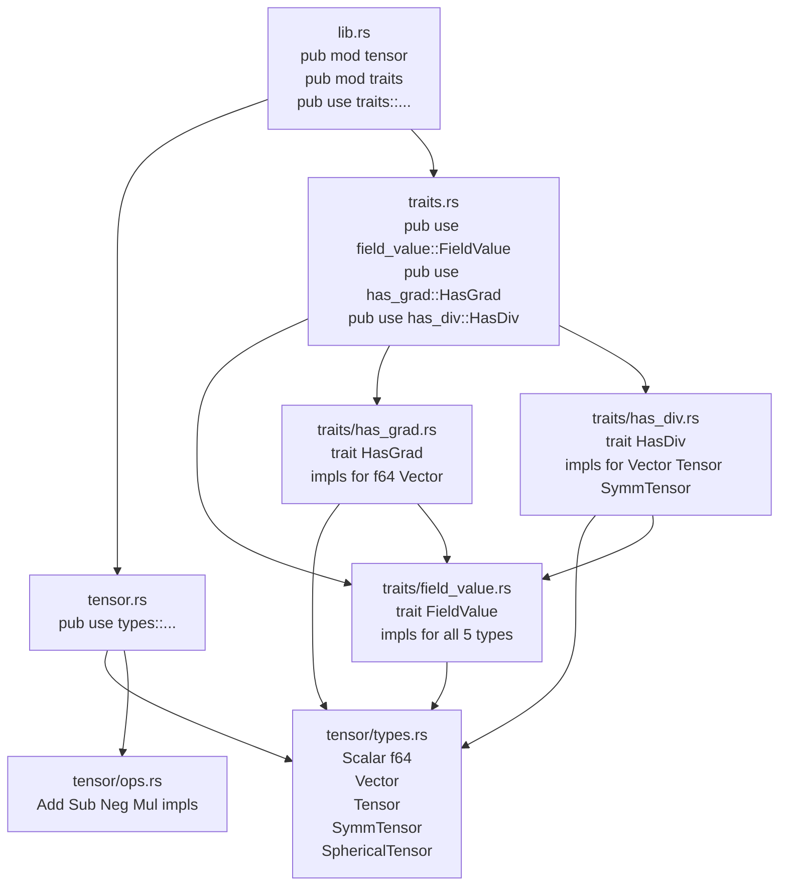

# 技術設計書: types-field-value

## 概要

本機能は `dugong-types` クレートに `FieldValue` trait およびランク昇降 trait（`HasGrad` / `HasDiv`）を追加する。これらは FVM フィールド演算の基盤となる型抽象化であり、フィールド値の加減算・スカラー倍・零元・ノルム計算を型安全に統一し、微分演算子（勾配・発散）の入出力型をコンパイル時に決定する仕組みを提供する。

**対象ユーザー**: ライブラリ開発者および下流クレート（`fields`、`discretization`）の実装者。下流クレートは `use dugong_types::{FieldValue, HasGrad, HasDiv}` という単一インポートで trait を利用できる。

**影響**: `dugong-types` クレートの `lib.rs` に `pub mod traits` が追加され、3 つの公開 trait がクレートルートから直接アクセス可能になる。既存の `tensor` モジュールへの変更はない。

### Goals
- `FieldValue` trait によるフィールド値の統一インターフェース（加減算・スカラー倍・零元・ノルム）の定義
- `HasGrad` / `HasDiv` associated type によるコンパイル時のランク昇降型決定
- 既存テンソル型 5 種（`f64`, `Vector`, `Tensor`, `SymmTensor`, `SphericalTensor`）への実装

### Non-Goals
- `SymmTensor` への `HasGrad` 実装（CFD 的に必要となる段階で別 Spec で対応）
- `SphericalTensor` への `HasGrad` / `HasDiv` 実装
- `dyn FieldValue` による動的ディスパッチのサポート
- 上位クレート（`fields`、`discretization`）への変更

---

## 要件トレーサビリティ

| 要件 | 概要 | コンポーネント | インターフェース |
|------|------|--------------|----------------|
| 1.1–1.5 | `FieldValue` trait 定義・ゼロ元・mag | `FieldValue` trait | `zero() -> Self`, `mag(&self) -> f64` |
| 2.1–2.6 | 全テンソル型への `FieldValue` 実装 | `FieldValue` implementations | 各型の `zero()`・`mag()` |
| 3.1–3.5 | `HasGrad` trait・`f64`・`Vector` への実装 | `HasGrad` trait | `type GradOutput: FieldValue` |
| 4.1–4.6 | `HasDiv` trait・`Vector`・`Tensor`・`SymmTensor` への実装 | `HasDiv` trait | `type DivOutput: FieldValue` |
| 5.1–5.6 | モジュール構成・公開 API・コンパイル品質 | `traits` モジュール・`lib.rs` | `pub use` 再エクスポート |

---

## アーキテクチャ

### 既存アーキテクチャ分析

`dugong-types` クレートは現在 `tensor` モジュールのみを持つ。モジュール構成は `rust-practices.md` の「`foo.rs` + `foo/` ディレクトリ」パターンに従っている（`tensor.rs` + `tensor/`）。`tensor/` 配下には `types.rs`、`ops.rs`、`convert.rs`、`cross_ops.rs`、`special.rs`、`tests.rs` が存在する。

すべてのテンソル型は `Copy + Add<Output=Self> + Sub<Output=Self> + Mul<f64, Output=Self> + Neg<Output=Self>` をすでに満たしている（`ops.rs` 確認済み）。したがって `FieldValue` の各実装では `zero()` と `mag()` の 2 メソッドのみを提供すればよい。

### アーキテクチャパターン & バウンダリマップ

**選択パターン**: 既存モジュールへの並置拡張（Additive Extension）
既存の `tensor` モジュールを変更せず、同レベルに `traits` モジュールを追加する。循環依存は発生しない（`traits` は `tensor` の型を参照するが `tensor` は `traits` に依存しない）。



**ステアリングコンプライアンス**:
- `rust-practices.md`: `mod.rs` 禁止 → `traits.rs` + `traits/` 構成を採用
- `rust-practices.md`: 小さく焦点を絞った trait → 3 trait を個別ファイルに分離
- `structure.md`: `types` クレートはどこにも依存しない → `std::ops` のみ使用

### テクノロジースタック

| レイヤー | 選択 | 本機能での役割 | 備考 |
|----------|------|---------------|------|
| 言語・エディション | Rust Edition 2024 | trait 定義・実装 | 既存スタックを継承 |
| 標準ライブラリ | `std::ops` (Add, Sub, Mul, Neg) | `FieldValue` スーパートレイトバウンド | 新規外部依存なし |
| ビルドシステム | Cargo ワークスペース | クレート単体テスト (`cargo test -p dugong-types`) | 変更なし |

新規外部依存は不要。すべてのバウンドは `std::ops` で充足する。

---

## コンポーネントとインターフェース

### コンポーネントサマリー

| コンポーネント | レイヤー | 役割 | 要件カバレッジ | 主要依存 |
|--------------|---------|------|--------------|---------|
| `FieldValue` trait | traits/基盤 | フィールド値の統一インターフェース定義 | 1.1–1.5, 2.1–2.6, 5.1–5.6 | `std::ops` (P0) |
| `HasGrad` trait | traits/ランク昇格 | 勾配演算子の出力型のコンパイル時決定 | 3.1–3.5, 5.1–5.6 | `FieldValue` (P0) |
| `HasDiv` trait | traits/ランク降格 | 発散演算子の出力型のコンパイル時決定 | 4.1–4.6, 5.1–5.6 | `FieldValue` (P0) |
| `traits` モジュール | crate root | trait の集約・再エクスポート | 5.1–5.2 | 上記 3 コンポーネント (P0) |

---

### traits/基盤レイヤー

#### `FieldValue` trait

| フィールド | 詳細 |
|-----------|------|
| Intent | フィールド値として使用可能な型の共通インターフェース（加減算・スカラー倍・零元・ノルム） |
| Requirements | 1.1, 1.2, 1.3, 1.4, 1.5, 2.1, 2.2, 2.3, 2.4, 2.5, 2.6 |

**Responsibilities & Constraints**
- `FieldValue` が求めるすべての演算はスーパートレイトバウンドとして宣言する（blanket impl を回避するためメソッドを trait 本体に定義しない）。
- `zero()` は加法単位元を返す静的メソッド。`z + x == x` を任意の `x` について保証する（要件 1.4）。
- `mag()` は Euclidean / Frobenius ノルムを返し、零元に対して `mag() < 1e-14` を保証する（要件 2.6）。
- `dyn FieldValue` は意図的に非サポート（静的ディスパッチのみ）。

**Dependencies**
- Inbound: `HasGrad::GradOutput: FieldValue`, `HasDiv::DivOutput: FieldValue` — 下流 trait が上限バウンドとして参照 (P1)
- External: `std::ops::{Add, Sub, Mul, Neg}` — スーパートレイトバウンドとして使用 (P0)

**Contracts**: Service [x]

##### Service Interface

```rust
pub trait FieldValue:
    Copy
    + Add<Output = Self>
    + Sub<Output = Self>
    + Mul<f64, Output = Self>
    + Neg<Output = Self>
{
    /// 加法単位元を返す。`z + x == x` をすべての `x` について保証する。
    fn zero() -> Self;

    /// Euclidean ノルム（ベクトル）または Frobenius ノルム（テンソル）を返す。
    /// 非負の `f64` を返す。`Self::zero().mag() < 1e-14` を保証する。
    fn mag(&self) -> f64;
}
```

**各型の実装コントラクト**:

| 型 | `zero()` | `mag()` の計算式 |
|----|----------|-----------------|
| `f64` | `0.0_f64` | `self.abs()` |
| `Vector` | `Vector::new(0.0, 0.0, 0.0)` | `√(x² + y² + z²)` |
| `Tensor` | 9 成分すべて `0.0` の `Tensor` | `√(Σᵢⱼ aᵢⱼ²)` (9 成分) |
| `SymmTensor` | 6 成分すべて `0.0` の `SymmTensor` | `√(xx² + yy² + zz² + 2·xy² + 2·xz² + 2·yz²)` |
| `SphericalTensor` | `SphericalTensor::new(0.0)` | `√3 · \|s\|` |

- Preconditions: なし
- Postconditions: `zero().mag() < 1e-14`（要件 2.6）；`mag()` は常に非負
- Invariants: `zero() + x == x`（加法単位元の数学的保証、要件 1.4）

**Implementation Notes**
- Integration: `traits/field_value.rs` が `super::super::tensor::types` または `crate::tensor` からテンソル型をインポートする。
- Validation: 単体テストで各型の `zero().mag() < 1e-14` を確認（絶対誤差 `< 1e-14`）。
- Risks: `SymmTensor::mag()` の対角外成分係数 2 の誤記リスク → 単体テストで数値検証。

---

### traits/ランク昇格レイヤー

#### `HasGrad` trait

| フィールド | 詳細 |
|-----------|------|
| Intent | 勾配演算子の出力型をコンパイル時に決定する associated type trait |
| Requirements | 3.1, 3.2, 3.3, 3.4, 3.5 |

**Responsibilities & Constraints**
- associated type `GradOutput` は `FieldValue` バウンドを持つ。これにより勾配結果がさらなるフィールド演算で使用できる（要件 3.4）。
- `f64 → Vector`、`Vector → Tensor` の 2 つの実装のみ提供（要件 3.2、3.3）。
- `HasGrad` を実装しない型をこの trait が要求されるコンテキストで使用するとコンパイルエラーになる（要件 3.5）。

**Dependencies**
- Inbound: 下流クレート (`fields`, `discretization`) が `T: HasGrad` バウンドで参照 (P1)
- External: `FieldValue` (本 Spec で定義) (P0)

**Contracts**: Service [x]

##### Service Interface

```rust
pub trait HasGrad {
    /// 勾配演算子の出力型。`FieldValue` を実装していることを保証する。
    type GradOutput: FieldValue;
}

// impl HasGrad for f64  { type GradOutput = Vector; }
// impl HasGrad for Vector { type GradOutput = Tensor; }
```

- Preconditions: `T: HasGrad` バウンドを満たす型のみ使用可能
- Postconditions: `T::GradOutput` は `FieldValue` を実装する
- Invariants: 実装テーブル `f64 → Vector`、`Vector → Tensor` はコンパイル時に固定

**Implementation Notes**
- Integration: `traits/has_grad.rs` で trait 定義と 2 つの `impl` を一括定義する。
- Validation: `compile_fail` doctest で `SymmTensor: HasGrad` が存在しないことを検証（要件 3.5）。
- Risks: 将来 `SymmTensor` へ `HasGrad` を追加する際、別 Spec で管理する。

---

### traits/ランク降格レイヤー

#### `HasDiv` trait

| フィールド | 詳細 |
|-----------|------|
| Intent | 発散演算子の出力型をコンパイル時に決定する associated type trait |
| Requirements | 4.1, 4.2, 4.3, 4.4, 4.5, 4.6 |

**Responsibilities & Constraints**
- associated type `DivOutput` は `FieldValue` バウンドを持つ（要件 4.5）。
- `Vector → f64`、`Tensor → Vector`、`SymmTensor → Vector` の 3 つの実装を提供（要件 4.2–4.4）。
- `HasDiv` を実装しない型に適用するとコンパイルエラー（要件 4.6）。

**Dependencies**
- Inbound: 下流クレート (`fields`, `discretization`) が `T: HasDiv` バウンドで参照 (P1)
- External: `FieldValue` (本 Spec で定義) (P0)

**Contracts**: Service [x]

##### Service Interface

```rust
pub trait HasDiv {
    /// 発散演算子の出力型。`FieldValue` を実装していることを保証する。
    type DivOutput: FieldValue;
}

// impl HasDiv for Vector      { type DivOutput = f64;    }
// impl HasDiv for Tensor      { type DivOutput = Vector; }
// impl HasDiv for SymmTensor  { type DivOutput = Vector; }
```

- Preconditions: `T: HasDiv` バウンドを満たす型のみ使用可能
- Postconditions: `T::DivOutput` は `FieldValue` を実装する
- Invariants: 実装テーブル固定（`Vector → f64`、`Tensor → Vector`、`SymmTensor → Vector`）

**Implementation Notes**
- Integration: `traits/has_div.rs` で trait 定義と 3 つの `impl` を一括定義する。
- Validation: `compile_fail` doctest で `f64: HasDiv` が存在しないことを検証（要件 4.6）。
- Risks: `SymmTensor::DivOutput = Vector` であり `Tensor::DivOutput = Vector` も同じ。型推論上は問題ないが、下流の実装者が意図を混同しないよう `///` ドキュメントコメントで区別する。

---

### クレートルートレイヤー

#### `traits` モジュール & 公開 API

| フィールド | 詳細 |
|-----------|------|
| Intent | 3 trait を集約し、クレートルートから直接インポート可能にする |
| Requirements | 5.1, 5.2, 5.3 |

**Responsibilities & Constraints**
- `traits.rs`: サブモジュール宣言（`mod field_value; mod has_grad; mod has_div;`）と再エクスポート（`pub use`）を担う。
- `lib.rs`: `pub mod traits;` および `pub use traits::{FieldValue, HasGrad, HasDiv};` を追加し、`use dugong_types::{FieldValue, HasGrad, HasDiv}` を下流で使用可能にする（要件 5.2）。
- 全公開 trait アイテムに `///` ドキュメントコメントを付与する（要件 5.3）。

**Dependencies**
- Inbound: 下流クレート (`dugong-fields` 等) が `use dugong_types::...` でインポート (P1)
- Outbound: `tensor::types::{Scalar, Vector, Tensor, SymmTensor, SphericalTensor}` を各実装ファイルで参照 (P0)

---

## テスト戦略

### 単体テスト（`crates/types/src/traits/` または `src/` 内 `#[cfg(test)]`）

**`FieldValue` 実装テスト** (要件 2.6 対応):
- `test_f64_zero_mag_is_zero`: `f64::zero().mag() < 1e-14`
- `test_vector_zero_mag_is_zero`: `Vector::zero().mag() < 1e-14`
- `test_tensor_zero_mag_is_zero`: `Tensor::zero().mag() < 1e-14`
- `test_symm_tensor_zero_mag_is_zero`: `SymmTensor::zero().mag() < 1e-14`
- `test_spherical_tensor_zero_mag_is_zero`: `SphericalTensor::zero().mag() < 1e-14`
- `test_vector_mag_known_value`: `Vector::new(3.0, 4.0, 0.0).mag()` が `5.0` に近い（相対誤差 `< 1e-14`）
- `test_symm_tensor_frobenius_off_diagonal_doubled`: 対角外成分の係数 2 を確認するテスト
- `test_spherical_tensor_mag`: `SphericalTensor::new(1.0).mag()` が `√3` に近い

**`HasGrad` / `HasDiv` 型レベルテスト** (要件 3.4, 4.5 対応):
- `test_f64_grad_output_is_vector`: `<f64 as HasGrad>::GradOutput` が `Vector` であること（型アノテーションで検証）
- `test_vector_grad_output_is_tensor`: `<Vector as HasGrad>::GradOutput` が `Tensor` であること
- `test_vector_div_output_is_f64`: `<Vector as HasDiv>::DivOutput` が `f64` であること
- `test_tensor_div_output_is_vector`: `<Tensor as HasDiv>::DivOutput` が `Vector` であること
- `test_symm_tensor_div_output_is_vector`: `<SymmTensor as HasDiv>::DivOutput` が `Vector` であること

**`compile_fail` テスト** (要件 3.5, 4.6 対応):
- `SymmTensor: HasGrad` 不成立の doctest
- `f64: HasDiv` 不成立の doctest

### コンパイル品質テスト (要件 5.4–5.6)
- `cargo build -p dugong-types` がエラーなしで完了すること
- `cargo clippy -p dugong-types` が警告ゼロであること
- `cargo test -p dugong-types` がすべてパスすること

---

## データモデル

本機能で新たなデータ構造は導入しない。型・実装のみ追加する。

**型階層の静的マップ（ランク昇降テーブル）**:

```
f64 (ランク 0)  ──HasGrad──>  Vector (ランク 1)  ──HasGrad──>  Tensor (ランク 2)
f64 (ランク 0)  <──HasDiv──   Vector (ランク 1)  <──HasDiv──   Tensor (ランク 2)
                                                <──HasDiv──   SymmTensor (ランク 2, 対称)
```

この静的テーブルはコンパイル時に確定し、実行時オーバーヘッドはゼロ。

---

## エラーハンドリング

本機能は純粋な型レベルの抽象化であり、実行時エラーは発生しない。エラーはすべてコンパイル時に型システムが検出する。

- **コンパイル時**: `T: HasGrad` / `T: HasDiv` バウンドを満たさない型の使用 → コンパイルエラー（要件 3.5, 4.6）
- **数値的境界**: `mag()` は浮動小数点演算の範囲内（overflow/NaN の可能性は入力値依存だが、trait としては保証範囲外）

パニックは発生しない（すべての演算は `f64` の標準算術のみ）。

---

## 参考情報

詳細な数学的導出、既存コードの実装確認ログ、アーキテクチャパターン評価の比較表については `.kiro/specs/types-field-value/research.md` を参照。
