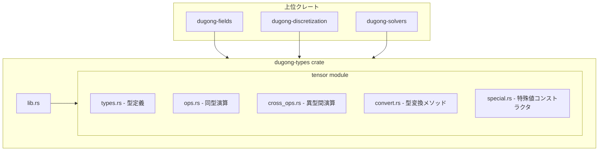
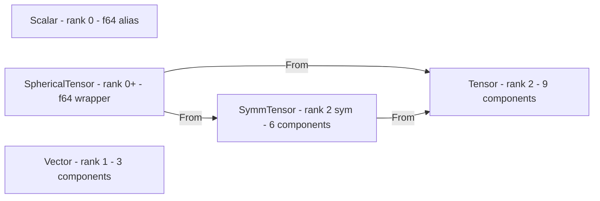

# Technical Design: types-tensor

## Overview

**Purpose**: `dugong-types` クレートの `tensor` モジュールとして、CFD フレームワークの基盤となるテンソル型群（`Scalar`, `Vector`, `Tensor`, `SymmTensor`, `SphericalTensor`）とその演算を提供する。

**Users**: フレームワーク開発者が物理量の型安全な表現と演算に使用する。上位クレート（`fields`, `discretization`, `solvers`）の全てがこの型群に依存する。

**Impact**: `dugong-types` クレートの空の `lib.rs` に `tensor` モジュールを新規追加する。既存コードへの変更はなく、破壊的影響はない。

### Goals
- 全 5 種のテンソル型を newtype パターンで型安全に定義する
- 同型・異型間の算術演算を `std::ops` trait で提供する
- 型変換・分解メソッド（`symm`, `dev`, `sph`, `trace`, `det` 等）を提供する
- `From` trait による安全なランク昇格変換を提供する
- 数値正確性を検証するテストスイートを提供する

### Non-Goals
- 次元検査（`Dim<V, M, L, T>`）— 別仕様で実装予定
- MPI データ型の導出（`#[derive(Equivalence)]`）— 並列化仕様で対応
- SIMD 最適化 — 将来の性能最適化フェーズで検討
- 4 階テンソル — 現時点の CFD 要件に含まれない

## Architecture

### Architecture Pattern & Boundary Map



**Architecture Integration**:
- **Selected pattern**: フラットライブラリモジュール — `tensor` モジュール内をサブファイルに分割し、`pub use` で再エクスポート
- **Domain boundaries**: `tensor` モジュールは純粋な数学型ライブラリ。物理次元・フィールド・メッシュの概念を一切含まない
- **Existing patterns preserved**: steering の newtype パターン、`Copy` セマンティクス、snake_case 命名
- **New components rationale**: 各サブファイルは関心を分離し、並列タスク実装を可能にする
- **Steering compliance**: `types` クレートは依存なし（structure.md）、`Copy` 型はスタック割り当て（rust-practices.md）

### Technology Stack

| Layer | Choice / Version | Role in Feature | Notes |
|-------|------------------|-----------------|-------|
| Language | Rust Edition 2024 | 全実装 | workspace 設定に準拠 |
| Build | Cargo workspace | `dugong-types` クレートの一部 | 外部依存なし |
| Test | `cargo test` | 数値正確性の検証 | 浮動小数点許容誤差あり |

外部クレート依存はゼロ。`std` のみ使用する。

## Requirements Traceability

| Requirement | Summary | Components | Interfaces | Flows |
|-------------|---------|------------|------------|-------|
| 1.1 | Scalar 型エイリアス | types.rs | `type Scalar = f64` | — |
| 1.2 | Vector newtype | types.rs | `struct Vector([f64; 3])` | — |
| 1.3 | Tensor newtype | types.rs | `struct Tensor([f64; 9])` | — |
| 1.4 | SymmTensor newtype | types.rs | `struct SymmTensor([f64; 6])` | — |
| 1.5 | SphericalTensor newtype | types.rs | `struct SphericalTensor(f64)` | — |
| 1.6 | derive Copy/Clone/Debug/PartialEq | types.rs | `#[derive(...)]` | — |
| 1.7 | コンストラクタ new | types.rs | `fn new(...)` | — |
| 1.8 | 内部データアクセサ | types.rs | `fn as_array()`, 成分名メソッド | — |
| 2.1–2.6 | 同型 Add/Sub/Neg/Mul/Div | ops.rs | `std::ops` trait impl | — |
| 2.7–2.8 | 同型 Assign 演算 | ops.rs | `AddAssign` 等の impl | — |
| 3.1–3.5 | 異型間加算・減算 | cross_ops.rs | `Add`/`Sub` の異型 impl | — |
| 3.6–3.11 | 単縮約（`*` 演算子） | cross_ops.rs | `Mul` の異型 impl | — |
| 3.12–3.13 | 二重縮約 | cross_ops.rs | `fn double_dot(...)` | — |
| 3.14 | テンソル積 | cross_ops.rs | `fn outer(...)` | — |
| 3.15 | クロス積 | cross_ops.rs | `fn cross(...)` | — |
| 4.1–4.15 | 型変換メソッド | convert.rs | `fn symm()` 等のメソッド | — |
| 5.1–5.3 | From 変換 | convert.rs | `impl From<...>` | — |
| 6.1–6.7 | 特殊値コンストラクタ | special.rs | `fn zero()`, `fn identity()` | — |
| 7.1–7.8 | テスト・品質 | tests/ | テストモジュール | — |

## Components and Interfaces

| Component | Domain/Layer | Intent | Req Coverage | Key Dependencies | Contracts |
|-----------|--------------|--------|--------------|------------------|-----------|
| types.rs | 型定義 | テンソル型の構造体定義 | 1.1–1.8 | なし | Service |
| ops.rs | 演算 | 同型基本演算の trait impl | 2.1–2.8 | types.rs (P0) | Service |
| cross_ops.rs | 演算 | 異型間演算の trait impl | 3.1–3.15 | types.rs (P0) | Service |
| convert.rs | 変換 | 型変換メソッドと From impl | 4.1–4.15, 5.1–5.3 | types.rs (P0) | Service |
| special.rs | 生成 | 特殊値コンストラクタ | 6.1–6.7 | types.rs (P0) | Service |

### 型定義層

#### types.rs

| Field | Detail |
|-------|--------|
| Intent | 全テンソル型の構造体定義、コンストラクタ、アクセサの提供 |
| Requirements | 1.1, 1.2, 1.3, 1.4, 1.5, 1.6, 1.7, 1.8 |

**Responsibilities & Constraints**
- 5 種のテンソル型を定義し、`Copy`, `Clone`, `Debug`, `PartialEq` を derive する
- 各型に `new()` コンストラクタと内部データアクセサを提供する
- `Scalar` は `f64` の型エイリアス（newtype ではない）
- 内部フィールドは private とし、`as_array()` / `value()` アクセサ経由でアクセスする

**Dependencies**
- Inbound: なし
- Outbound: なし
- External: なし

**Contracts**: Service [x]

##### Service Interface

```rust
/// f64 の型エイリアス
pub type Scalar = f64;

/// 3 次元ベクトル
#[derive(Copy, Clone, Debug, PartialEq)]
pub struct Vector([f64; 3]);

impl Vector {
    /// 成分を指定して生成する
    pub fn new(x: f64, y: f64, z: f64) -> Self;
    /// 配列として取得する
    pub fn as_array(&self) -> &[f64; 3];
    /// 各成分アクセサ
    pub fn x(&self) -> f64;
    pub fn y(&self) -> f64;
    pub fn z(&self) -> f64;
}

/// 3×3 テンソル（row-major）
#[derive(Copy, Clone, Debug, PartialEq)]
pub struct Tensor([f64; 9]);

impl Tensor {
    /// 9 成分を row-major 順で指定して生成する
    pub fn new(xx: f64, xy: f64, xz: f64,
               yx: f64, yy: f64, yz: f64,
               zx: f64, zy: f64, zz: f64) -> Self;
    /// 配列として取得する
    pub fn as_array(&self) -> &[f64; 9];
    /// 成分アクセサ（xx, xy, xz, yx, yy, yz, zx, zy, zz）
    pub fn xx(&self) -> f64;
    pub fn xy(&self) -> f64;
    // ... 残り 7 成分
}

/// 対称テンソル（上三角 row-major: xx, xy, xz, yy, yz, zz）
#[derive(Copy, Clone, Debug, PartialEq)]
pub struct SymmTensor([f64; 6]);

impl SymmTensor {
    /// 6 独立成分を指定して生成する
    pub fn new(xx: f64, xy: f64, xz: f64,
               yy: f64, yz: f64, zz: f64) -> Self;
    /// 配列として取得する
    pub fn as_array(&self) -> &[f64; 6];
    /// 成分アクセサ（xx, xy, xz, yy, yz, zz）
    pub fn xx(&self) -> f64;
    // ... 残り 5 成分
}

/// 球面テンソル（sI を表すスカラー値）
#[derive(Copy, Clone, Debug, PartialEq)]
pub struct SphericalTensor(f64);

impl SphericalTensor {
    /// スカラー値を指定して生成する
    pub fn new(s: f64) -> Self;
    /// 内部値を取得する
    pub fn value(&self) -> f64;
}
```

- Preconditions: なし（全入力値は有効な `f64`）
- Postconditions: 各型のインスタンスが生成される
- Invariants: 内部データの成分数は型ごとに固定（Vector=3, Tensor=9, SymmTensor=6, SphericalTensor=1）

**Implementation Notes**
- 内部フィールドは private。演算モジュールは `as_array()` / `value()` アクセサ経由でアクセスする。LTO 環境下で `#[inline]` アクセサはゼロコスト
- `PartialEq` は浮動小数点の bitwise 比較。近似比較はテスト用ヘルパーで対応
- `Display` trait は現時点では非要件（将来の I/O 仕様で追加可能）

---

### 演算層

#### ops.rs

| Field | Detail |
|-------|--------|
| Intent | 同型テンソル間の基本算術演算の提供 |
| Requirements | 2.1, 2.2, 2.3, 2.4, 2.5, 2.6, 2.7, 2.8 |

**Responsibilities & Constraints**
- `Vector`, `Tensor`, `SymmTensor`, `SphericalTensor` に `Add`, `Sub`, `Neg`, `Mul<f64>`, `Div<f64>` を実装する
- `f64` に対する `Mul<Vector>`, `Mul<Tensor>`, `Mul<SymmTensor>`, `Mul<SphericalTensor>` を実装する
- `AddAssign`, `SubAssign`, `MulAssign<f64>`, `DivAssign<f64>` を実装する
- 全ての演算は成分ごと（component-wise）で実行する

**Dependencies**
- Inbound: types.rs — テンソル型の定義 (P0)

**Contracts**: Service [x]

##### Service Interface

```rust
// 各テンソル型 T に対して以下の trait を実装
// T = Vector | Tensor | SymmTensor | SphericalTensor

impl Add for T { type Output = T; }
impl Sub for T { type Output = T; }
impl Neg for T { type Output = T; }
impl Mul<f64> for T { type Output = T; }    // 右スカラー倍
impl Mul<T> for f64 { type Output = T; }    // 左スカラー倍
impl Div<f64> for T { type Output = T; }    // スカラー除算
impl AddAssign for T {}
impl SubAssign for T {}
impl MulAssign<f64> for T {}
impl DivAssign<f64> for T {}
```

- Preconditions: `Div<f64>` でゼロ除算は呼び出し側の責務（パニックしない保証はしない）
- Postconditions: 演算結果は数学的に正しい成分ごとの計算
- Invariants: `a + b == b + a`（可換性）、`a + (-a) ≈ zero`

**Implementation Notes**
- `SphericalTensor` の `Add`/`Sub` は単一 `f64` 値の演算
- `SymmTensor` の演算は 6 成分に対して行う
- ゼロ除算は Rust の `f64` セマンティクス（`inf`/`nan`）に従う

---

#### cross_ops.rs

| Field | Detail |
|-------|--------|
| Intent | 異なるテンソルランク間の物理的に意味のある演算の提供 |
| Requirements | 3.1–3.15 |

**Responsibilities & Constraints**
- 異型間加算・減算（ランク昇格規則に従う）
- 単縮約（`Mul` trait、`rank(A) + rank(B) - 2`）: 内積・行列積・行列ベクトル積
- 二重縮約（名前付きメソッド `double_dot`、`rank(A) + rank(B) - 4`）
- テンソル積（名前付きメソッド `outer`、`rank(A) + rank(B)`）
- クロス積（名前付きメソッド `cross`、`rank(A) + rank(B) - 1`）

**Dependencies**
- Inbound: types.rs — テンソル型の定義 (P0)

**Contracts**: Service [x]

##### Service Interface

```rust
// =============================================================
// 演算子設計原則:
//   * (Mul trait) = 単縮約: rank(A) + rank(B) - 2
//   OpenFOAM の operator& に相当。Rust では & のオーバーロードが
//   不可のため、最も利用頻度の高い単縮約に * を割り当てる。
//   ランク変化が異なる演算は名前付きメソッドで提供する。
// =============================================================

// --- 異型間加算・減算 ---

// SymmTensor + SphericalTensor → SymmTensor
impl Add<SphericalTensor> for SymmTensor { type Output = SymmTensor; }
impl Add<SymmTensor> for SphericalTensor { type Output = SymmTensor; }
impl Sub<SphericalTensor> for SymmTensor { type Output = SymmTensor; }
impl Sub<SymmTensor> for SphericalTensor { type Output = SymmTensor; }

// Tensor + SymmTensor → Tensor
impl Add<SymmTensor> for Tensor { type Output = Tensor; }
impl Sub<SymmTensor> for Tensor { type Output = Tensor; }

// Tensor + SphericalTensor → Tensor
impl Add<SphericalTensor> for Tensor { type Output = Tensor; }
impl Sub<SphericalTensor> for Tensor { type Output = Tensor; }

// --- 単縮約（Mul trait: rank(A) + rank(B) - 2）---

// Vector(1) * Vector(1) → f64(0)  — 内積
impl Mul<Vector> for Vector { type Output = f64; }

// Tensor(2) * Vector(1) → Vector(1)  — 行列・ベクトル積
impl Mul<Vector> for Tensor { type Output = Vector; }

// Vector(1) * Tensor(2) → Vector(1)  — ベクトル・行列積（v^T * T）
impl Mul<Tensor> for Vector { type Output = Vector; }

// Tensor(2) * Tensor(2) → Tensor(2)  — 行列積
impl Mul<Tensor> for Tensor { type Output = Tensor; }

// SymmTensor(2) * Vector(1) → Vector(1)
impl Mul<Vector> for SymmTensor { type Output = Vector; }

// SymmTensor(2) * SymmTensor(2) → Tensor(2)  — 行列積（結果は非対称）
impl Mul<SymmTensor> for SymmTensor { type Output = Tensor; }

// --- 二重縮約（名前付きメソッド: rank(A) + rank(B) - 4）---

impl Tensor {
    /// テンソル二重縮約: A:B = Σ_ij A_ij * B_ij
    pub fn double_dot(&self, other: &Tensor) -> f64;
}

impl SymmTensor {
    /// 対称テンソル二重縮約: A:B = Σ_ij A_ij * B_ij
    pub fn double_dot(&self, other: &SymmTensor) -> f64;
}

// --- テンソル積（名前付きメソッド: rank(A) + rank(B)）---

impl Vector {
    /// テンソル積: a ⊗ b → Tensor（T_ij = a_i * b_j）
    pub fn outer(&self, other: &Vector) -> Tensor;
}

// --- クロス積（名前付きメソッド: rank(A) + rank(B) - 1）---

impl Vector {
    /// クロス積: a × b → Vector
    pub fn cross(&self, other: &Vector) -> Vector;
}
```

- Preconditions: なし
- Postconditions: 演算結果は線形代数の定義に一致する
- Invariants:
  - `(T * v).mag() <= T.mag() * v.mag()`（ノルムの副乗法性）
  - `T.double_dot(&Tensor::identity()) == T.trace()`
  - `a * b == b * a`（ベクトル内積の可換性）
  - `a.cross(&b) == -(b.cross(&a))`（クロス積の反可換性）
  - `a * a.cross(&b) ≈ 0.0`（クロス積は両入力に直交）

**Implementation Notes**
- `*` 演算子は全ての型の組み合わせで「単縮約（rank - 2）」を意味する。これは OpenFOAM の `operator&` に対応する
- `Vector * Vector` は OpenFOAM の `operator&(Vector, Vector)` に相当する内積。`f64` を返す
- `SymmTensor * SymmTensor` の結果は一般に非対称テンソルとなるため `Tensor` を返す
- 異型間加算では、低ランク型を暗黙的に高ランク型に展開してから加算する（例: `SphericalTensor` → 対角 `SymmTensor`）
- `Vector * Tensor` は `v^T * T` として計算（結果はベクトル）
- `SymmTensor * Vector` は 6 成分から直接計算して効率化する
- 二重縮約の定義: `A:B = Σ_ij A_ij * B_ij`（Frobenius 内積）
- `cross()` は OpenFOAM の `operator^(Vector, Vector)` に相当

---

### 変換層

#### convert.rs

| Field | Detail |
|-------|--------|
| Intent | テンソルの代数的分解・変換メソッドと From trait 実装の提供 |
| Requirements | 4.1–4.15, 5.1–5.3 |

**Responsibilities & Constraints**
- `Tensor` の分解メソッド: `symm`, `two_symm`, `sph`, `skew`, `dev`, `trace`, `det`, `transpose`, `mag`
- `SymmTensor` のメソッド: `trace`, `det`, `dev`, `sph`
- `Vector` のメソッド: `mag`, `mag_sqr`
- `From` trait による型変換: `SphericalTensor → SymmTensor`, `SphericalTensor → Tensor`, `SymmTensor → Tensor`

**Dependencies**
- Inbound: types.rs — テンソル型の定義 (P0)

**Contracts**: Service [x]

##### Service Interface

```rust
// --- Tensor メソッド ---

impl Tensor {
    /// 対称部分: (T + T^T) / 2
    pub fn symm(&self) -> SymmTensor;

    /// 2 倍対称部分: T + T^T
    pub fn two_symm(&self) -> SymmTensor;

    /// 球面部分: (trace / 3) * I
    pub fn sph(&self) -> SphericalTensor;

    /// 反対称部分: (T - T^T) / 2
    pub fn skew(&self) -> Tensor;

    /// 偏差部分: T - sph(T) = T - (trace/3)*I
    pub fn dev(&self) -> Tensor;

    /// トレース: T_xx + T_yy + T_zz
    pub fn trace(&self) -> f64;

    /// 行列式（3×3 の完全展開）
    pub fn det(&self) -> f64;

    /// 転置: T^T
    pub fn transpose(&self) -> Tensor;

    /// フロベニウスノルム: sqrt(T:T)
    pub fn mag(&self) -> f64;
}

// --- SymmTensor メソッド ---

impl SymmTensor {
    /// トレース: S_xx + S_yy + S_zz
    pub fn trace(&self) -> f64;

    /// 行列式（対称行列の 3×3 展開）
    pub fn det(&self) -> f64;

    /// 偏差部分: S - (trace/3)*I
    pub fn dev(&self) -> SymmTensor;

    /// 球面部分: (trace / 3) * I
    pub fn sph(&self) -> SphericalTensor;
}

// --- Vector メソッド ---

impl Vector {
    /// ユークリッドノルム: sqrt(x² + y² + z²)
    pub fn mag(&self) -> f64;

    /// 二乗マグニチュード: x² + y² + z²
    pub fn mag_sqr(&self) -> f64;
}

// --- From 変換 ---

/// SphericalTensor → SymmTensor: 対角成分に s を設定
impl From<SphericalTensor> for SymmTensor {}

/// SphericalTensor → Tensor: 対角成分に s を設定
impl From<SphericalTensor> for Tensor {}

/// SymmTensor → Tensor: 対称テンソルの完全 3×3 展開
impl From<SymmTensor> for Tensor {}
```

- Preconditions: なし
- Postconditions:
  - `T.symm() + T.skew() == T`（対称・反対称分解の完全性）
  - `T.dev().trace() ≈ 0.0`（偏差テンソルのトレースはゼロ）
  - `Tensor::from(T.symm()).symm() == T.symm()`（べき等性）
- Invariants:
  - `From` 変換は情報を保存する（低ランク → 高ランクの埋め込み）

**Implementation Notes**
- `det()` の計算: サルスの方法（3×3 行列式の直接展開）を使用。数値安定性は十分
- `SymmTensor::det()` は 6 成分から直接計算（`xx*(yy*zz - yz²) - xy*(xy*zz - yz*xz) + xz*(xy*yz - yy*xz)`）
- `From<SymmTensor> for Tensor` は対称性を利用して `[xx, xy, xz, xy, yy, yz, xz, yz, zz]` に展開

---

### 生成層

#### special.rs

| Field | Detail |
|-------|--------|
| Intent | 零テンソル・単位テンソルなどの特殊値コンストラクタの提供 |
| Requirements | 6.1, 6.2, 6.3, 6.4, 6.5, 6.6, 6.7 |

**Responsibilities & Constraints**
- 各型に `zero()` メソッドを提供する
- `Tensor`, `SymmTensor`, `SphericalTensor` に `identity()` メソッドを提供する
- `const fn` として定義し、コンパイル時定数として使用可能にする

**Dependencies**
- Inbound: types.rs — テンソル型の定義 (P0)

**Contracts**: Service [x]

##### Service Interface

```rust
impl Vector {
    /// 全成分ゼロのベクトル
    pub const fn zero() -> Self;
}

impl Tensor {
    /// 全成分ゼロのテンソル
    pub const fn zero() -> Self;
    /// 3×3 単位行列
    pub const fn identity() -> Self;
}

impl SymmTensor {
    /// 全成分ゼロの対称テンソル
    pub const fn zero() -> Self;
    /// 対角成分 1 の対称テンソル
    pub const fn identity() -> Self;
}

impl SphericalTensor {
    /// 値ゼロの球面テンソル
    pub const fn zero() -> Self;
    /// 値 1 の球面テンソル（単位球面テンソル）
    pub const fn identity() -> Self;
}
```

- Preconditions: なし
- Postconditions:
  - `T::zero()` は全成分がゼロ
  - `T::identity()` は単位元（型に応じた定義）
- Invariants:
  - `A + T::zero() == A`（零元の性質）
  - `Tensor::identity() * v == v`（単位元の性質）

**Implementation Notes**
- `const fn` により静的定数として使用可能（例: `const ZERO: Vector = Vector::zero();`）

## Appendix: 演算の成分定義

実装者向けの全演算の成分レベル定義。各型の内部格納順を前提とする。

### 演算子設計原則

`*` 演算子（`Mul` trait）は**単縮約**を表し、結果のランクは以下の規則に従う:

```
rank(A * B) = rank(A) + rank(B) - 2
```

| 演算 | ランク変化 | Rust での提供方法 | OpenFOAM 対応 |
|------|-----------|-----------------|--------------|
| 単縮約 | rank - 2 | `*` 演算子（`Mul` trait） | `operator&` |
| テンソル積 | rank + 0 (sum) | `outer()` メソッド | `operator*` |
| クロス積 | rank - 1 | `cross()` メソッド | `operator^` |
| 二重縮約 | rank - 4 | `double_dot()` メソッド | `operator&&` |

### 内部格納順（再掲）

| 型 | 内部配列 | 成分順 |
|---|---------|--------|
| `Vector` | `[f64; 3]` | `[x, y, z]` |
| `Tensor` | `[f64; 9]` | `[xx, xy, xz, yx, yy, yz, zx, zy, zz]`（row-major） |
| `SymmTensor` | `[f64; 6]` | `[xx, xy, xz, yy, yz, zz]`（上三角 row-major） |
| `SphericalTensor` | `f64` | `s`（対角テンソル `sI` を表す） |

### 同型演算（ops.rs）

全型共通で成分ごと（component-wise）に演算する。`SphericalTensor` は単一値。

```
Add:  result[i] = a[i] + b[i]
Sub:  result[i] = a[i] - b[i]
Neg:  result[i] = -a[i]
Mul(f64):  result[i] = a[i] * s
Div(f64):  result[i] = a[i] / s
```

### 異型間加算・減算（cross_ops.rs）

#### SymmTensor ± SphericalTensor → SymmTensor

SphericalTensor `s` は対角成分にのみ影響する:

```
result = [xx ± s, xy, xz, yy ± s, yz, zz ± s]
```

`SphericalTensor ± SymmTensor` も同じ結果（加算は可換、減算は符号反転）。

#### Tensor ± SymmTensor → Tensor

SymmTensor `[Sxx, Sxy, Sxz, Syy, Syz, Szz]` を 9 成分に展開して加算:

```
result = [xx ± Sxx, xy ± Sxy, xz ± Sxz,
          yx ± Sxy, yy ± Syy, yz ± Syz,
          zx ± Sxz, zy ± Syz, zz ± Szz]
```

注意: `SymmTensor` の `xy` 成分が `Tensor` の `xy` と `yx` の両方に加算される。

#### Tensor ± SphericalTensor → Tensor

```
result = [xx ± s, xy,     xz,
          yx,     yy ± s, yz,
          zx,     zy,     zz ± s]
```

### 単縮約（cross_ops.rs — `*` 演算子）

全て `rank(A) + rank(B) - 2` の規則に従う。

#### Vector * Vector → f64（内積、rank 1+1-2=0）

```
result = ax*bx + ay*by + az*bz
```

#### Tensor * Vector → Vector（行列・ベクトル積、rank 2+1-2=1）

`r_i = Σ_j T_ij * v_j`:

```
rx = xx*vx + xy*vy + xz*vz
ry = yx*vx + yy*vy + yz*vz
rz = zx*vx + zy*vy + zz*vz
```

#### Vector * Tensor → Vector（ベクトル・行列積: v^T * T、rank 1+2-2=1）

`r_j = Σ_i v_i * T_ij`:

```
rx = vx*xx + vy*yx + vz*zx
ry = vx*xy + vy*yy + vz*zy
rz = vx*xz + vy*yz + vz*zz
```

注意: `Tensor * Vector` とは結果が異なる（転置の関係）。

#### Tensor * Tensor → Tensor（行列積、rank 2+2-2=2）

`R_ij = Σ_k A_ik * B_kj`:

```
Rxx = Axx*Bxx + Axy*Byx + Axz*Bzx
Rxy = Axx*Bxy + Axy*Byy + Axz*Bzy
Rxz = Axx*Bxz + Axy*Byz + Axz*Bzz
Ryx = Ayx*Bxx + Ayy*Byx + Ayz*Bzx
Ryy = Ayx*Bxy + Ayy*Byy + Ayz*Bzy
Ryz = Ayx*Bxz + Ayy*Byz + Ayz*Bzz
Rzx = Azx*Bxx + Azy*Byx + Azz*Bzx
Rzy = Azx*Bxy + Azy*Byy + Azz*Bzy
Rzz = Azx*Bxz + Azy*Byz + Azz*Bzz
```

#### SymmTensor * Vector → Vector（rank 2+1-2=1）

`SymmTensor` の対称性（`yx=xy`, `zx=xz`, `zy=yz`）を利用して 6 成分から直接計算:

```
rx = xx*vx + xy*vy + xz*vz
ry = xy*vx + yy*vy + yz*vz
rz = xz*vx + yz*vy + zz*vz
```

#### SymmTensor * SymmTensor → Tensor（行列積、rank 2+2-2=2）

`R_ij = Σ_k A_ik * B_kj`（対称性を利用して展開）:

```
Rxx = Axx*Bxx + Axy*Bxy + Axz*Bxz
Rxy = Axx*Bxy + Axy*Byy + Axz*Byz
Rxz = Axx*Bxz + Axy*Byz + Axz*Bzz
Ryx = Axy*Bxx + Ayy*Bxy + Ayz*Bxz
Ryy = Axy*Bxy + Ayy*Byy + Ayz*Byz
Ryz = Axy*Bxz + Ayy*Byz + Ayz*Bzz
Rzx = Axz*Bxx + Ayz*Bxy + Azz*Bxz
Rzy = Axz*Bxy + Ayz*Byy + Azz*Byz
Rzz = Axz*Bxz + Ayz*Byz + Azz*Bzz
```

注意: 結果は一般に非対称テンソルとなるため `Tensor` を返す。

### 二重縮約（cross_ops.rs）

#### Tensor::double_dot(&Tensor) → f64

`A:B = Σ_ij A_ij * B_ij`（全 9 成分の要素積の和）:

```
result = Axx*Bxx + Axy*Bxy + Axz*Bxz
       + Ayx*Byx + Ayy*Byy + Ayz*Byz
       + Azx*Bzx + Azy*Bzy + Azz*Bzz
```

#### SymmTensor::double_dot(&SymmTensor) → f64

対称性により非対角成分が 2 回出現するため、6 成分から計算する場合:

```
result = Axx*Bxx + Ayy*Byy + Azz*Bzz
       + 2*(Axy*Bxy + Axz*Bxz + Ayz*Byz)
```

### テンソル積（cross_ops.rs — `outer` メソッド）

#### Vector::outer(&Vector) → Tensor（rank 1+1=2）

`T_ij = a_i * b_j`:

```
result = [ax*bx, ax*by, ax*bz,
          ay*bx, ay*by, ay*bz,
          az*bx, az*by, az*bz]
```

### クロス積（cross_ops.rs — `cross` メソッド）

#### Vector::cross(&Vector) → Vector（rank 1+1-1=1）

```
rx = ay*bz - az*by
ry = az*bx - ax*bz
rz = ax*by - ay*bx
```

### 型変換メソッド（convert.rs）

#### Tensor::symm() → SymmTensor

対称部分 `S_ij = (T_ij + T_ji) / 2`:

```
result = [xx, (xy+yx)/2, (xz+zx)/2, yy, (yz+zy)/2, zz]
```

#### Tensor::two_symm() → SymmTensor

2 倍対称部分 `S_ij = T_ij + T_ji`:

```
result = [2*xx, xy+yx, xz+zx, 2*yy, yz+zy, 2*zz]
```

#### Tensor::skew() → Tensor

反対称部分 `A_ij = (T_ij - T_ji) / 2`:

```
result = [0,         (xy-yx)/2, (xz-zx)/2,
          (yx-xy)/2, 0,         (yz-zy)/2,
          (zx-xz)/2, (zy-yz)/2, 0        ]
```

対角成分は常にゼロ。

#### Tensor::trace() → f64

```
result = xx + yy + zz
```

#### Tensor::sph() → SphericalTensor

```
result = SphericalTensor((xx + yy + zz) / 3)
```

#### Tensor::dev() → Tensor

偏差部分 `D = T - (tr/3)*I`（`tr = xx + yy + zz`）:

```
result = [xx - tr/3, xy,       xz,
          yx,        yy - tr/3, yz,
          zx,        zy,        zz - tr/3]
```

#### Tensor::det() → f64

サルスの方法（3×3 行列式の直接展開）:

```
result = xx*(yy*zz - yz*zy)
       - xy*(yx*zz - yz*zx)
       + xz*(yx*zy - yy*zx)
```

#### Tensor::transpose() → Tensor

```
result = [xx, yx, zx, xy, yy, zy, xz, yz, zz]
```

#### Tensor::mag() → f64

フロベニウスノルム `||T||_F = sqrt(T:T)`:

```
result = sqrt(xx² + xy² + xz² + yx² + yy² + yz² + zx² + zy² + zz²)
```

#### SymmTensor::trace() → f64

```
result = xx + yy + zz
```

#### SymmTensor::det() → f64

対称性を利用した展開（`yx=xy`, `zx=xz`, `zy=yz`）:

```
result = xx*(yy*zz - yz*yz)
       - xy*(xy*zz - yz*xz)
       + xz*(xy*yz - yy*xz)
```

#### SymmTensor::dev() → SymmTensor

`tr = xx + yy + zz`:

```
result = [xx - tr/3, xy, xz, yy - tr/3, yz, zz - tr/3]
```

#### SymmTensor::sph() → SphericalTensor

```
result = SphericalTensor((xx + yy + zz) / 3)
```

#### Vector::mag() → f64

```
result = sqrt(x² + y² + z²)
```

#### Vector::mag_sqr() → f64

```
result = x² + y² + z²
```

### From 変換（convert.rs）

#### From\<SphericalTensor\> for SymmTensor

```
result = [s, 0, 0, s, 0, s]
```

#### From\<SphericalTensor\> for Tensor

```
result = [s, 0, 0, 0, s, 0, 0, 0, s]
```

#### From\<SymmTensor\> for Tensor

```
result = [xx, xy, xz, xy, yy, yz, xz, yz, zz]
```

---

## Data Models

### Domain Model

テンソル型のランク階層:



**Value Objects（全て `Copy`）**:
- `Scalar`: `f64` の型エイリアス。テンソル演算の結果（`trace`, `det`, `double_dot`）の戻り値型
- `Vector`: 3 成分の不変値オブジェクト
- `Tensor`: 9 成分の不変値オブジェクト（row-major）
- `SymmTensor`: 6 成分の不変値オブジェクト（上三角 row-major: `[xx, xy, xz, yy, yz, zz]`）
- `SphericalTensor`: 単一 `f64` の不変値オブジェクト（`sI` を表す）

**Business Rules & Invariants**:
- `From` 変換はランク昇格方向のみ許可（`SphericalTensor → SymmTensor → Tensor`）
- 逆方向の変換は情報損失を伴うため、明示的メソッド（`symm()`, `sph()`）で提供
- 全ての型は `Copy` であり、所有権の問題は発生しない

## Error Handling

### Error Strategy

このモジュールは純粋な数学型ライブラリであり、`Result` によるエラー処理は不要。

- **コンパイル時防止**: 不正なテンソル演算（例: `Vector + Tensor`）は trait の未実装により型エラー
- **浮動小数点**: ゼロ除算は `f64` のセマンティクス（`inf`/`nan`）に従う。`panic` は発生しない
- **数値安定性**: `det()` 等で桁落ちが発生し得るが、回復不能ではないため `Result` でラップしない

## Testing Strategy

### Unit Tests（types.rs）
- `test_vector_new_and_accessors`: コンストラクタとアクセサの一致
- `test_tensor_new_row_major_order`: 成分の格納順序が row-major であること
- `test_symm_tensor_component_mapping`: 6 成分の格納順序と成分名アクセサの一致
- `test_copy_semantics`: `Copy` trait が正しく機能すること

### Unit Tests（ops.rs）
- `test_vector_add_sub_component_wise`: 成分ごとの加減算
- `test_tensor_scalar_mul_div`: スカラー倍・除算
- `test_neg_inverts_all_components`: 符号反転の全成分検証
- `test_left_scalar_mul_commutativity`: `2.0 * v == v * 2.0`
- `test_assign_ops_equivalence`: `a += b` と `a = a + b` の等価性

### Unit Tests（cross_ops.rs）
- `test_symm_tensor_plus_spherical_tensor`: 異型加算の手計算検証
- `test_vector_inner_product`: `v1 * v2` が内積を返すこと、可換性の検証
- `test_tensor_vector_contraction`: 行列・ベクトル積の手計算検証
- `test_tensor_tensor_contraction`: 行列積の手計算検証
- `test_symm_tensor_symm_tensor_contraction`: 対称テンソル行列積の手計算検証、結果が非対称であること
- `test_double_dot_with_identity`: `T.double_dot(&Tensor::identity()) == T.trace()` の検証
- `test_outer_product`: テンソル積の手計算検証
- `test_cross_product`: クロス積の手計算検証と反可換性・直交性（`a * a.cross(&b) ≈ 0.0`）

### Unit Tests（convert.rs）
- `test_symm_plus_skew_equals_original`: `symm() + skew() == T` の分解検証
- `test_dev_trace_is_zero`: `dev().trace() ≈ 0.0`
- `test_det_known_values`: 既知の行列式との比較
- `test_from_roundtrip`: `SymmTensor → Tensor → symm()` の往復一貫性
- `test_frobenius_norm`: `mag()` の手計算検証

### Unit Tests（special.rs）
- `test_zero_additive_identity`: `A + zero == A`
- `test_identity_multiplicative`: `identity * v == v`
- `test_identity_trace`: `Tensor::identity().trace() == 3.0`

### 数値比較方針
- 絶対誤差: ゼロ近傍の値には `1e-14` の許容誤差
- 相対誤差: 大きな値には `1e-10` の相対許容誤差
- テストヘルパー関数 `assert_approx_eq` を `#[cfg(test)]` モジュール内に定義
